# pyMDA

Python based Mechanical Design Automation (MDA) or Mechanical Computer Aided Design (MCAD)

Used to output OpenSCAD files (via SolidPython)

Overall - it needs a cleanup to organise and explain parts/functions, and perhaps port to muscad

For now, started a new OO based design approach - see [new/test.py](new/test.py) for a demo of the range of built-in parts and features. Here is a brackdown with some screenshots:

Built-in Part Assembly (using OO inheritance):

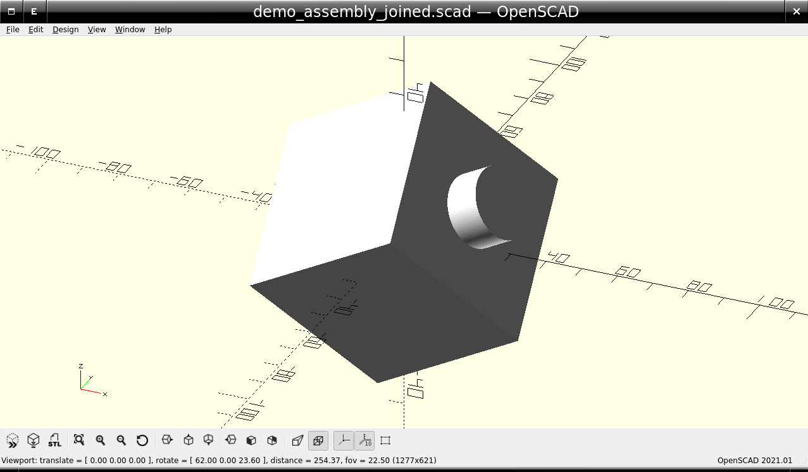

Built-in Geometry Parts:

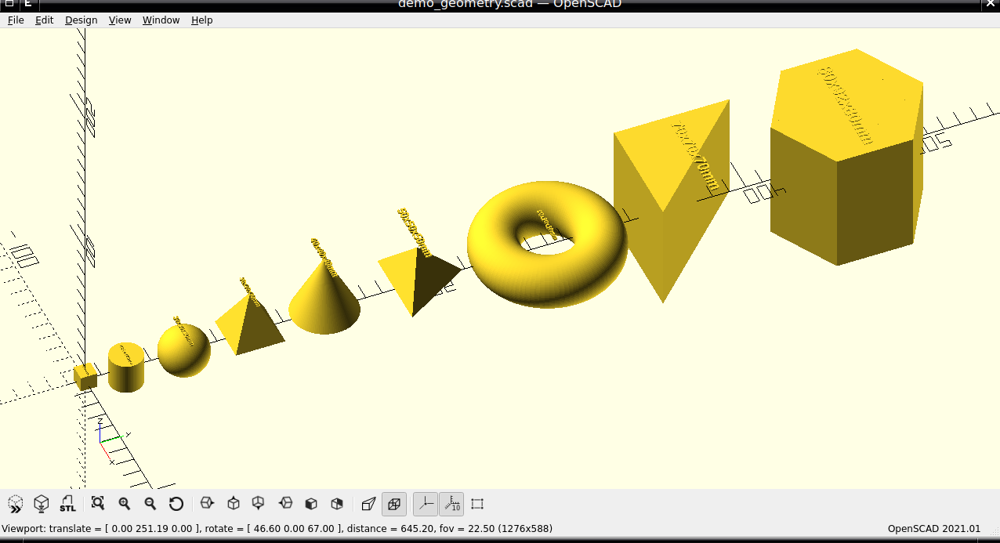

Built-in Curved Parts:

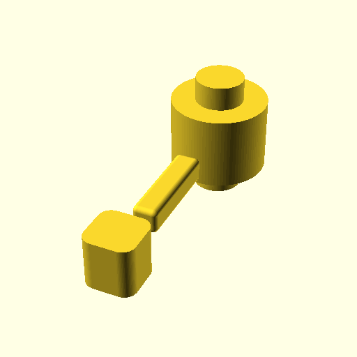

Built-in Point-based Parts:

Built-in Plate Parts:

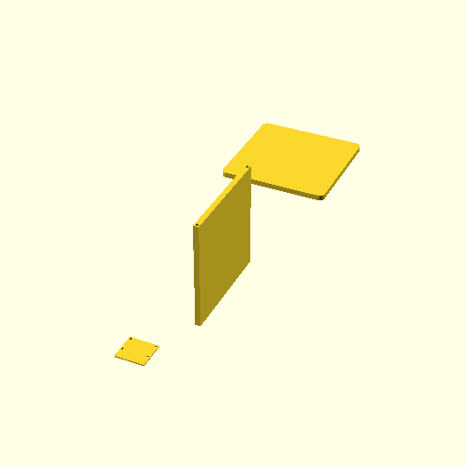

Built-in Hole Features:

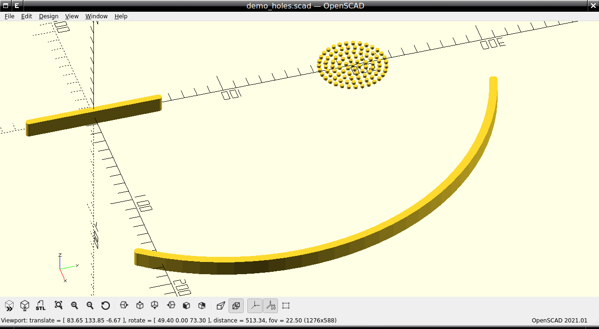

Built-in Enclosure Features:

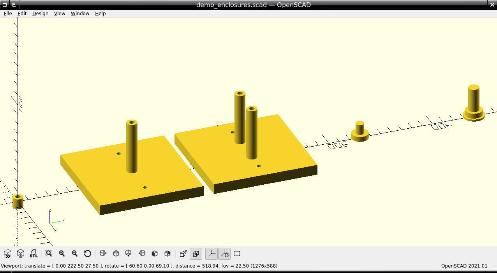

Built-in Other Features:

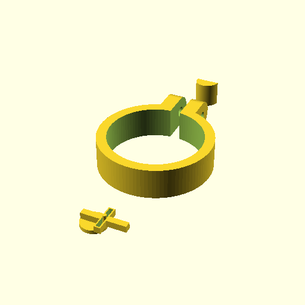

Built-in Stock Materials:

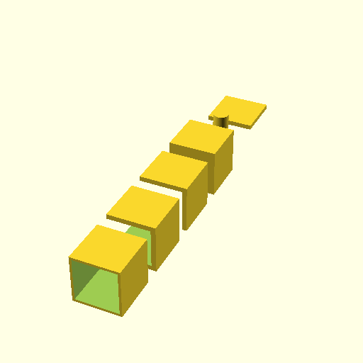

Built-in Stock Fixtures:

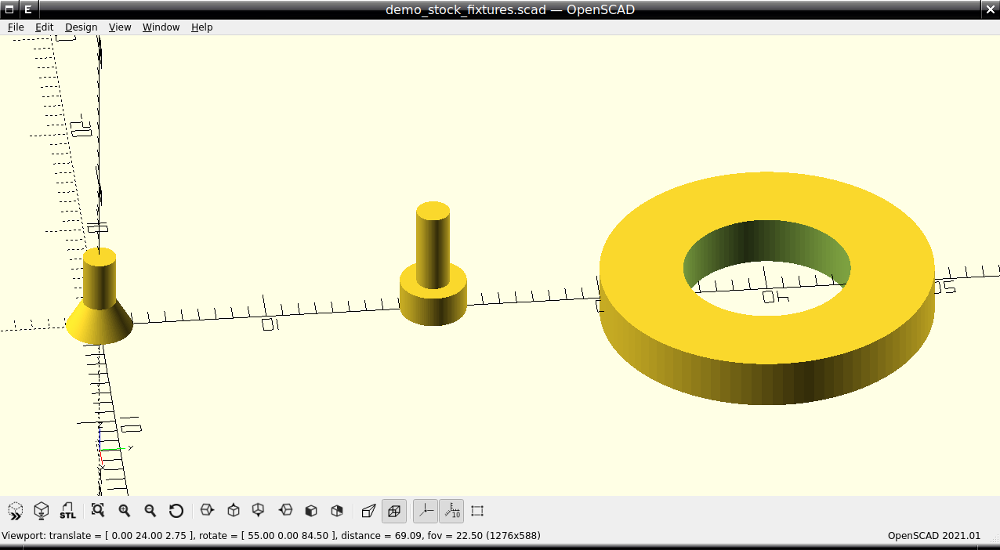

Built-in Stock Magnets:

Built-in Stock Bearings:

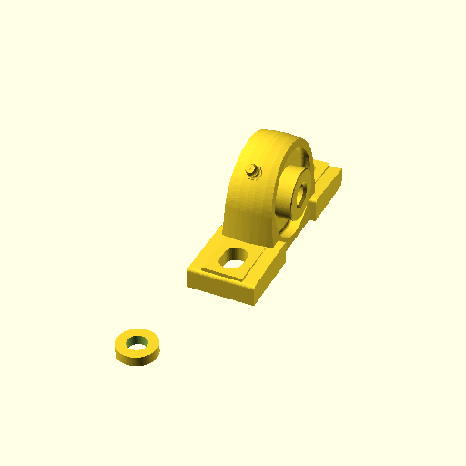

Built-in Stock Motors:

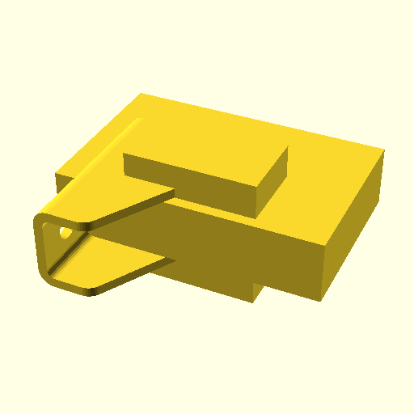

Built-in Stock Electronics:

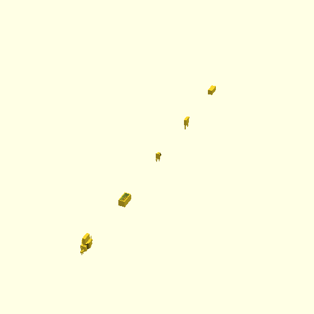
