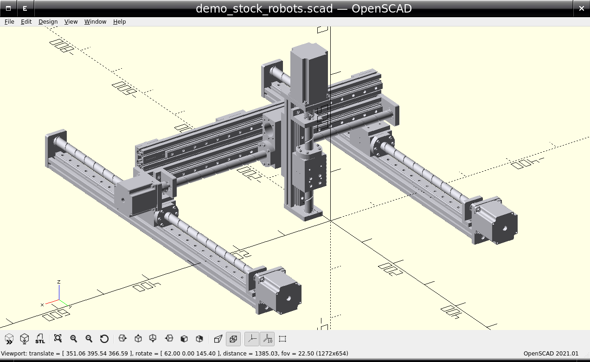

# pyMDA

Python based Mechanical Design Automation (MDA) or Mechanical Computer Aided Design (MCAD)

Used to output OpenSCAD files (via SolidPython)

See [test.py](test.py) for a demo of the range of built-in parts and features. Here is a brackdown with some screenshots:

Built-in Part Assembly (using OO inheritance):

Built-in Geometry Parts:

Built-in Curved Parts:

Built-in Point-based Parts:

Built-in Plate Parts:

Built-in Hole Features:

Built-in Enclosure Features:

Built-in Other Features:

Built-in Gears:

Built-in Stock Materials:

Built-in Stock Fixtures:

Built-in Stock Magnets:

Built-in Stock Bearings:

Built-in Stock Motors:

Built-in Stock Electronics:

Built-in Stock Robots:

